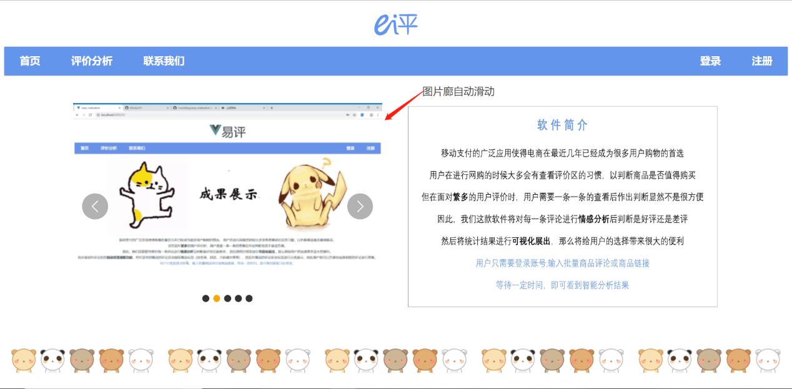
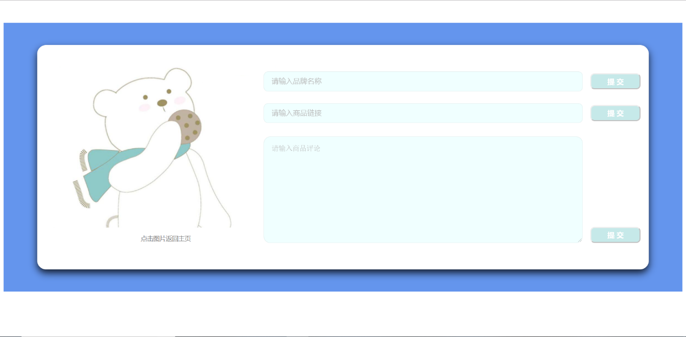
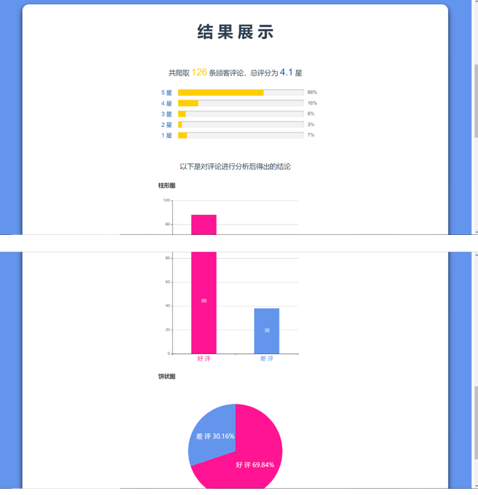
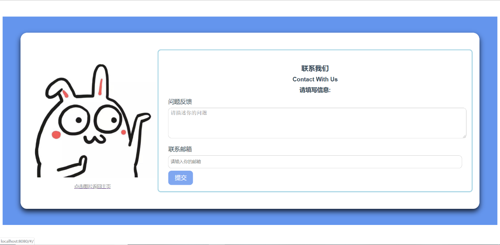

### 项目简介

前端部分以 HTML、CSS、JavaScript 为基础，采用 Vue 作为核心框架，搭建一个简洁美观 Web 应用平台

项目采用 Vue 全家桶帮助快速构建，具体技术如下：

* 使用 Vue CLI 搭建项目脚手架
* 使用 Vue Router 集中管理路由
* 使用 Vue Axios 实现网络请求
* 另外配置 Vuex 帮助集中管理数据，但是因为数据规模不大而未实际使用

### 项目构建

安装依赖

```
npm install
```

开发模式下运行项目

```
npm run serve
```

生产模式下打包项目

```
npm run build
```

```
npm run test
```

Lints and fixes files

### 项目展示

###### 首页界面



###### 输入评价



###### 结果展示



###### 联系我们

